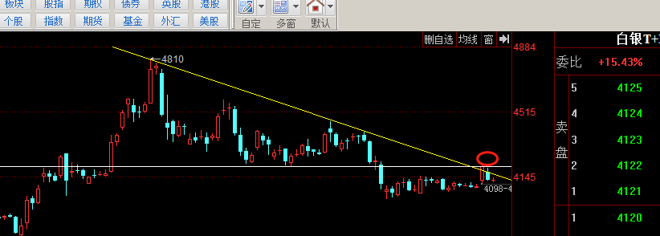

# MACD 指标
MACD称为异同移动平均线，是从双指数移动平均线发展而来的，由快的指数移动平均线（EMA12）减去慢的指数移动平均线（EMA26）得到快线DIF，再用2×（快线DIF-DIF的9日加权移动均线DEA）得到MACD柱。MACD的意义和双移动平均线基本相同，即由快、慢均线的离散、聚合表征当前的多空状态和股价可能的发展变化趋势，但阅读起来更方便。MACD的变化代表着市场趋势的变化，不同K线级别的MACD代表当前级别周期中的买卖趋势。

