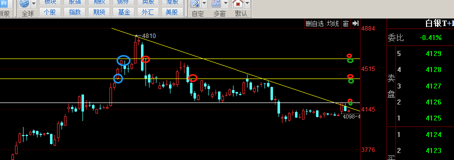
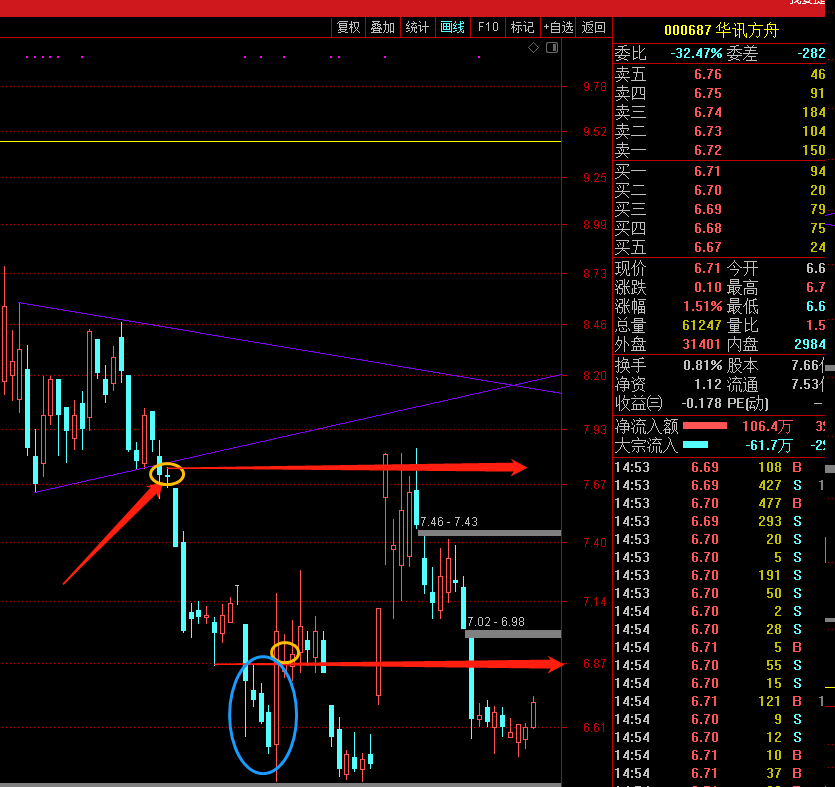
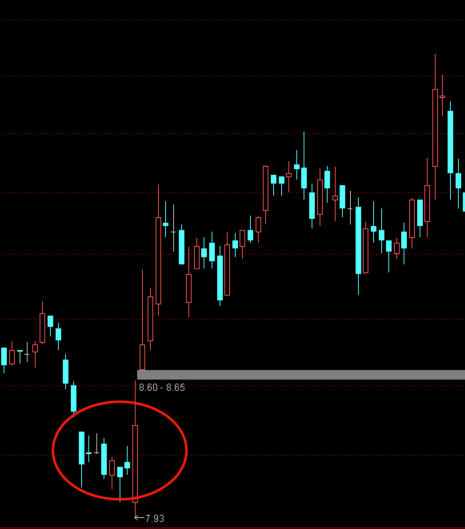
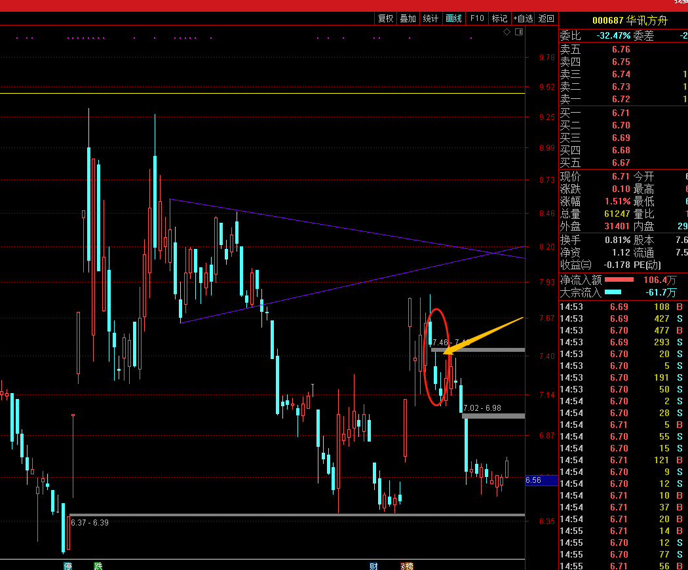
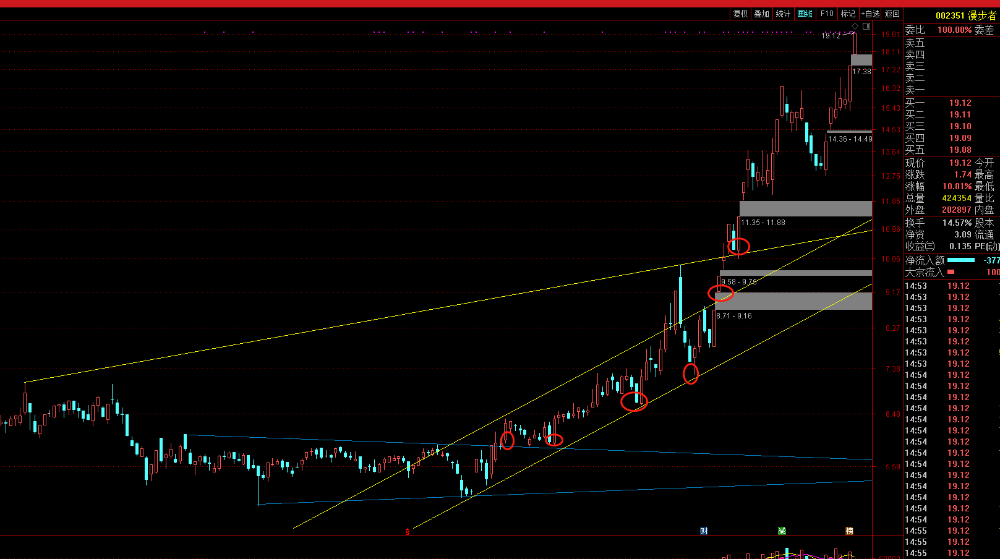
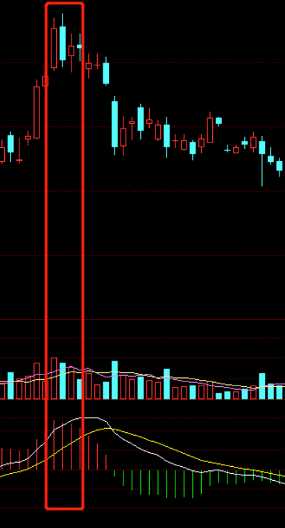
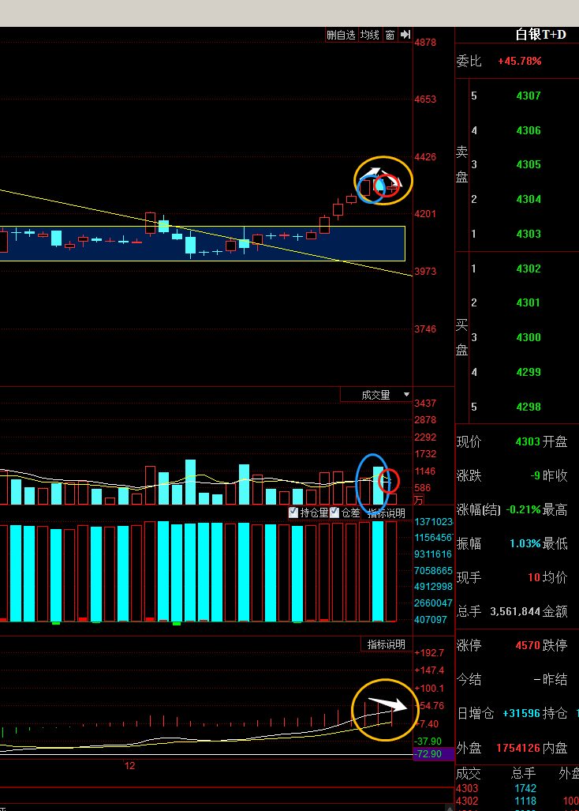
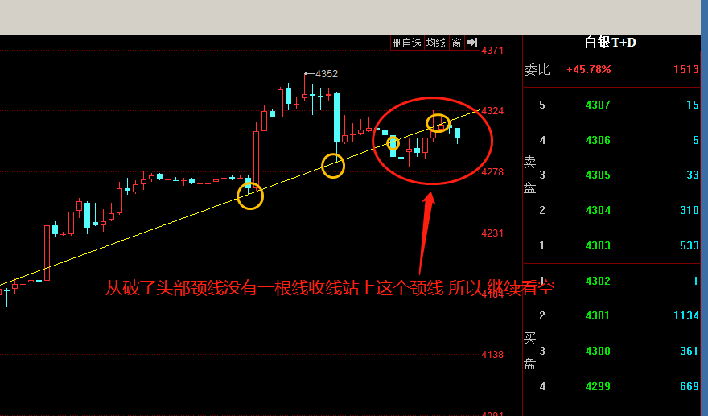
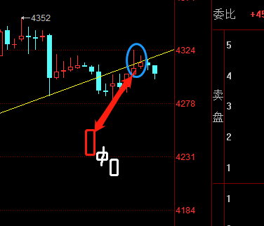

# 图说

1. 图1 白线以上看多 以下看空

2. 图2 支撑压力位

这样看支撑压力，最右侧红圈和绿圈位置：绿圈是平多反手做空，红圈是平空反手做多

3. 图3 白手套 看多

4. 图4 黑三兵 看空

连续两个跳空缺口 是个厉害的黑三兵

5. 图5 漫步者

6. 图7

量能和k线同时乌云盖顶，这是个空头迹象的信号，这个形态出来99%是看跌的 

现在看起来 是没有解放套牢盘 正好又收乌云盖顶 指标红柱缩短 均量线也在向下死叉 阴线量能明显盖过强劲阳线的量能 综合几点来看 是个下跌必备的条件完全符合 

你看对应颜色圈的指示  是不是下跌可以验证好几个指标指示

触线回落 说明这个根线压力强大 两次突破都没收上去 

两次突破 收线下来了 第三次触线就没过去 说明多头衰竭 触线下来了

7. 合并k线

前边阳线包含后边阳线 合并就是取短阳线的低点、高阳线的高点 合并线就是4307到4324这样一根阳线 而后边两根阴线 没有包含关系 所以 第一根阴线看多下降中继形态 第二根阴线看做下降线 毕竟第二根阴线连第一根阴线开盘价都没试探 只是第一根阴线的收盘价就是第二根阴线的开盘价也是最高价 等于随着第一根阴线直接下跌

8. 8
9.  90
10. 111
11. 111
12. 222
13. 34
14. 234
15. 2
16. 3
17. 2
18. 3
19. 2
20. 2
21. 2
22. 2
23. 2
24. 3
25. 

