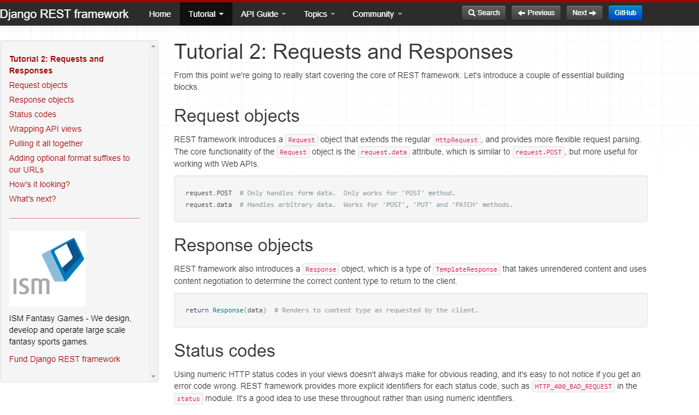

Django REST framework 是一个用来构建Web API的强大、灵活的工具箱。

下面是你可能会选择 REST framework的几个点:

- Web browsable API 对于你的开发来说，是一个强需求。
- 身份验证策略包括了OAuth1a 和 OAuth2。
- 序列化支持ORM和非ORM的数据源。
- 高度可定制化 - 如果你不需要更多、更强大的功能，也可以直接使用常规的、基于函数的视图 。
- 丰富的文档,和强大的社区支持。
- 被大量国际知名公司使用和信任，它们包括： Mozilla, Red Hat, Heroku, 和 Eventbrite。

