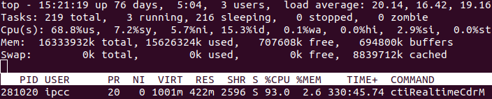
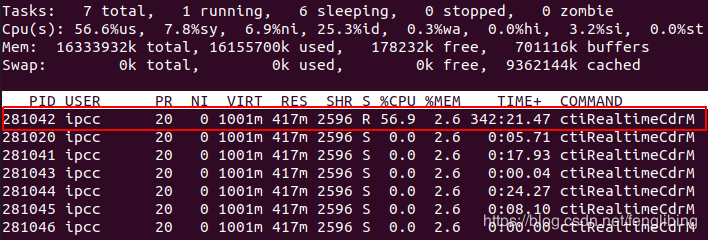
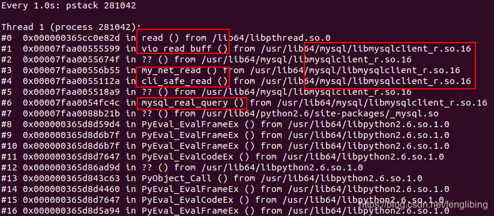
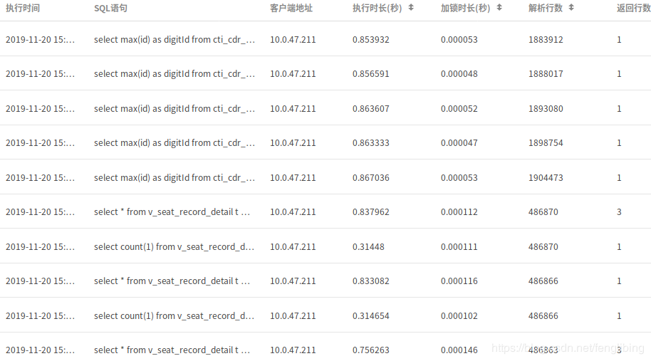

# Linux中Python应用CPU占用高问题排查

1、通过top命令查看其CPU占用



可以看到其load占用为“20.14, 16.42, 19.16”，三个数字分别表示cpu在1分钟、5分钟及15分钟的load，cpu的使用率也偏高，达到了68.8％，占用cpu较高的进程ID为281020。

2、通过ps查看该应用

```
$ ps aux|grep 281020
root     212891  0.0  0.0 103328   848 pts/3    S+   15:41   0:00 grep 281020
ipcc     281020 39.5  2.6 1025560 425540 ?      Sl   01:18 341:29 /usr/bin/python ./ctiRealtimeCdrMain.py default.xml
```

结果显示该应用为python应用。
3、查看进程中线程的CPU占用情况

在top中加入-H参数，查看该进程中线程的cpu战胜情况：

```
$ top -H -p 281020
```

结果如下：



可以看到进程281020中线程号为281042的线程战胜的CPU最多。
4、跟踪进程的执行栈

通过watch和pstack命令查看线程中命令的执行情况：

```
watch pstack 281042
```



可以看到从mysql中读取数据占用资源较多。
5、跟踪函数的调用

进一步通过strace命令进行验证：

```
$ strace -f -p 281042
```

结果如下：


其中大量的数据在执行数据库的写入（write）及读取（read）操作，上面的pstack命令并没有反映出write的问题，那问题应该出现在数据库的read操作上，初步猜测是数据库的select语句有问题，或者是没有走索引。
6、检查MySql的慢日志

进一步检查MySql的慢日志发现：



其中有大量的查询慢日志，SQL中使用了全表扫描的count、max、min这样的函数，终于确认问题造成的原因了，余下的就是让对方对做优化了。


---
## 实际案例

通过抓包分析数据发现，系统周期性的每分钟告警一次，CPU占用率较高

查看进程发现是统计数据库对表进行insert和delete操作。

业务中为snmp_server 会1分钟、10分钟、1小时定期插入stats表

操作的数据是从日志中统计而来。因为操作数据库时数据量较大，暂时性的占用较高资源。


