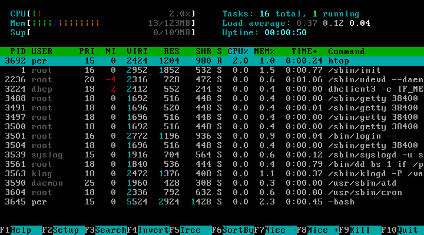

# linux 系统监控、诊断工具之 top 详解

接触 linux 的人对于 top 命令可能不会陌生（不同系统名字可能不一样，如 IBM 的 aix 中叫 topas ），它的作用主要用来监控系统实时负载率、进程的资源占用率及其它各项系统状态属性是否正常。

下面我们先来看张top截图：


## 1. 系统、任务统计信息：

前 8 行是系统整体的统计信息。第 1 行是任务队列信息，同 uptime 命令的执行结果。其内容如下：
参数|说明|
--|--|
11:03:59|当前时间|
up 142 days, 12:20|系统运行时间，格式为时:分|
1 user|当前登录用户数|
load average: 0.01, 0.02, 0.05|系统负载，即任务队列的平均长度。三个数值分别为 1分钟、5分钟、15分钟前到现在平均值。注意：这三个值可以用来判定系统是否负载过高——如果值持续大于系统 cpu 个数，就需要优化你的程序或者架构了。|

## 2. 进程、 cpu 统计信息：

第 2~6 行为进程和CPU的信息。当有多个CPU时，这些内容可能会超过两行。内容如下：
参数|说明|
--|--|
Tasks: 29 total|进程总数|
1 running|正在运行的进程数|
28 sleeping|睡眠的进程数|
0 stopped|停止的进程数|
0 zombie|僵尸进程数|
Cpu(s): 0.3% us	|用户空间占用CPU百分比|
1.0% sy|内核空间占用CPU百分比|
0.0% ni|用户进程空间内改变过优先级的进程占用CPU百分比|
98.7% id|空闲CPU百分比|
0.0% wa|等待输入输出的CPU时间百分比|
0.0% hi|Hardware IRQ|
0.0% si|Software IRQ|

注：

（1）IRQ: IRQ全称为Interrupt Request，即是“中断请求”的意思。

（2）st(Steal Time)：stole time 的缩写，该项指标只对虚拟机有效，表示分配给当前虚拟机的 CPU 时间之中，被同一台物理机上的其他虚拟机偷走的时间百分比

> So, relatively speaking, what does this mean? A high steal percentage may mean that you may be outgrowing your virtual machine with your hosting company. Other virtual machines may have a larger slice of the CPU’s time and you may need to ask for an upgrade in order to compete. Also, a high steal percentage may mean that your hosting company is overselling virtual machines on your particular server. If you upgrade your virtual machine and your steal percentage doesn’t drop, you may want to seek another provider. A low steal percentage can mean that your applications are working well with your current virtual machine. Since your VM is not wrestling with other VM’s constantly for CPU time, your VM will be more responsive. This may also suggest that your hosting provider is underselling their servers, which is definitely a good thing.0.0% sisi(Software Interrupts)

## 3. 最后两行为内存信息：
参数|说明|
--|--|
Mem: 191272k total|物理内存总量|
173656k used|使用的物理内存总量|
17616k free|空闲内存总量|
22052k buffers|用作内核缓存的内存量|
Swap: 192772k total|交换区总量|
0k used|使用的交换区总量|
192772k free|空闲交换区总量|
123988k cached|缓冲的交换区总量。内存中的内容被换出到交换区，而后又被换入到内存，但使用过的交换区尚未被覆盖，该数值即为这些内容已存在于内存中的交换区的大小。相应的内存再次被换出时可不必再对交换区写入。|

PS：如何计算可用内存和已用内存?  
除了 free -m 之外，也可以看 top：  
```
Mem:    255592k total,   167568k used,    88024k free,    25068k buffers
Swap:   524280k total,        0k used,   524280k free,    85724k cached
```
### 3.1  实际的程序可用内存数怎么算呢？
The answer is: free + (buffers + cached)

88024k + (25068k + 85724k) = 198816k

### 3.2  程序已用内存数又怎么算呢？
The answer is: used – (buffers + cached)

167568k – (25068k + 85724k) = 56776k

### 3.3  怎么判断系统是否内存不足呢？
如果你的 swap used 数值大于 0 ，基本可以判断已经遇到内存瓶颈了，要么优化你的代码，要么加内存。

### 3.4  buffer 与cache 的区别

A buffer is something that has yet to be “written” to disk. A cache is something that has been “read” from the disk and stored for later use 从应用程序角度来看，buffers/cached 是等于可用的，因为buffer/cached是为了提高文件读写的性能，当应用程序需在用到内存的时候，buffer/cached会很快地被回收。
所以从应用程序的角度来说，可用内存 = 系统free memory + buffers + cached.

buffers是指用来给块设备做的缓冲大小，他只记录文件系统的metadata以及 tracking in-flight pages.
cached是用来给文件做缓冲。
那就是说：buffers是用来存储，目录里面有什么内容，权限等等。
而cached直接用来记忆我们打开的文件，如果你想知道他是不是真的生效，你可以试一下，先后执行两次命令#man X ,你就可以明显的感觉到第二次的打开的速度快很多。

实验：在一台没有什么应用的机器上做会看得比较明显。记得实验只能做一次，如果想多做请换一个文件名。

```
#free
#man X
#free
#man X
#free
```
你可以先后比较一下free后显示buffers的大小。
另一个实验：
```
#free
#ls /dev
#free
```
你比较一下两个的大小，当然这个buffers随时都在增加，但你有ls过的话，增加的速度会变得快，这个就是buffers/chached的区别。
因为Linux将你暂时不使用的内存作为文件和数据缓存，以提高系统性能，当你需要这些内存时，系统会自动释放（不像windows那样，即使你有很多空闲内存,他也要访问一下磁盘中的pagefiles）

## 4. 进程信息区：

序号|列名|含义|
---|---|---|
a|PID|进程id|
b|PPID|父进程id|
c|RUSER|Real user name|
d|UID|进程所有者的用户id|
e|USER|进程所有者的用户名|
f|	GROUP|进程所有者的组名|
g|TTY|启动进程的终端名。不是从终端启动的进程则显示为 ?|
h|	PR|优先级|
i|NI|nice值。负值表示高优先级，正值表示低优先级|
j|P|最后使用的CPU，仅在多CPU环境下有意义|
k|%CPU|上次更新到现在的CPU时间占用百分比|
l|TIME|进程使用的CPU时间总计，单位秒|
m|	TIME+|进程使用的CPU时间总计，单位1/100秒|
n|%MEM|进程使用的物理内存百分比|
o|VIRT|进程使用的虚拟内存总量，单位kb。VIRT=SWAP+RES|
p|SWAP|进程使用的虚拟内存中，被换出的大小，单位kb|
q|RES|进程使用的、未被换出的物理内存大小，单位kb。RES=CODE+DATA|
r|CODE|可执行代码占用的物理内存大小，单位kb|
s|DATA|可执行代码以外的部分(数据段+栈)占用的物理内存大小，单位kb|
t|	SHR|共享内存大小，单位kb|
u|nFLT|页面错误次数|
v|nDRT|最后一次写入到现在，被修改过的页面数。|
w|S|进程状态。D=不可中断的睡眠状态;R=运行;S=睡眠;T=跟踪/停止;Z=僵尸进程|
x|COMMAND|命令名/命令行|
y|WCHAN|若该进程在睡眠，则显示睡眠中的系统函数名|
z|Flags|任务标志，参考 sched.h|

使用 pwdx + pid 找到业务进程路径

## 5. 查看指定列
默认情况下仅显示比较重要的 PID、USER、PR、NI、VIRT、RES、SHR、S、%CPU、%MEM、TIME+、COMMAND 列。  
可以通过下面的快捷键来更改显示内容：
### 5.1 f 键选择显示内容
通过 f 键可以选择显示的内容。按 f 键之后会显示列的列表，按 a-z 即可显示或隐藏对应的列，最后按回车键确定。

### 5.2 o 键改变显示顺序
按 o 键可以改变列的显示顺序。按小写的 a-z 可以将相应的列向右移动，而大写的 A-Z 可以将相应的列向左移动。最后按回车键确定。

### 5.3 F/O 键将进程按列排序
按大写的 F 或 O 键，然后按 a-z 可以将进程按照相应的列进行排序。而大写的 R 键可以将当前的排序倒转。

## 6. 常用交互命令

从使用角度来看，熟练的掌握这些命令比掌握选项还重要一些。这些命令都是单字母的，如果在命令行选项中使用了s选项，则可能其中一些命令会被屏蔽掉。  
Ctrl+L 擦除并且重写屏幕。  
h或者? 显示帮助画面，给出一些简短的命令总结说明。  
k 终止一个进程。系统将提示用户输入需要终止的进程PID，以及需要发送给该进程什么样的信号。一般的终止进程可以使用15信号；如果不能正常结束那就使用信号9强制结束该进程。默认值是信号15。在安全模式中此命令被屏蔽。  
i 忽略闲置和僵死进程。这是一个开关式命令。  
q 退出程序。  
r 重新安排一个进程的优先级别。系统提示用户输入需要改变的进程PID以及需要设置的进程优先级值。输入一个正值将使优先级降低，反之则可以使该进程拥有更高的优先权。默认值是10。  
S 切换到累计模式。  
s 改变两次刷新之间的延迟时间。系统将提示用户输入新的时间，单位为s。如果有小数，就换算成m s。输入0值则系统将不断刷新，默认值是5 s。需要注意的是如果设置太小的时间，很可能会引起不断刷新，从而根本来不及看清显示的情况，而且系统负载也会大大增加。  
f或者F 从当前显示中添加或者删除项目。  
o或者O 改变显示项目的顺序。  
l 切换显示平均负载和启动时间信息。  
m 切换显示内存信息。  
t 切换显示进程和CPU状态信息。  
c 切换显示命令名称和完整命令行。  
M 根据驻留内存大小进行排序。  
P 根据CPU使用百分比大小进行排序。  
T 根据时间/累计时间进行排序。  
W 将当前设置写入~/.toprc文件中。这是写top配置文件的推荐方法。  

## 7. 最后的技能：top 命令小技巧

1、输入大写P，则结果按CPU占用降序排序。  
2、输入大写M，结果按内存占用降序排序。  
3、按数字 1 则可以显示所有CPU核心的负载情况。  
4、top -d 5    每隔 5 秒刷新一次，默认 1 秒  
5、top -p 4360,4358    监控指定进程  
6、top -U johndoe    ‘U’为 真实/有效/保存/文件系统用户名。  
7、top -u 500    ‘u’为有效用户标识  
8、top -bn 1    显示所有进程信息，top -n 1 只显示一屏信息，供管道调用  
9、top -M   #show memory summary in megabytes not kilobytes  
10、top -p 25097 -n 1 -b    # -b 避免输出控制字符，管道调用出现乱码  
11、top翻页：top -bn1 | less  
12、增强版的 top：htop ，一个更加强大的交互式进程管理器：  


## 8. 进程基础知识


