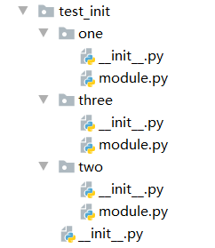
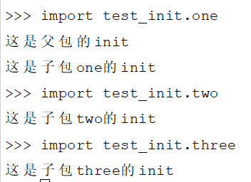
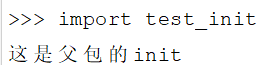
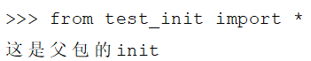
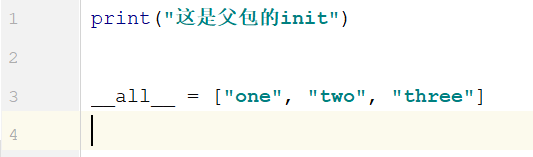
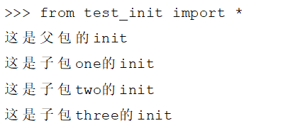

```
当你去看一些 Python 相关的项目时，常常会看到 __init__.py，当你使用某些编辑器创建 Python Package 的时候，它也会自动给你生成一个 __init__.py 文件。
```
这玩意有什么用呢？

我们知道， Python 中的包是可以包含多个 py 模块的，我们可以在不同的地方通过包名区分使用这些模块。

话不多说，咱们先来创建一下这样的目录：


```
我们在这里面创建了三个 Python 子包，里面都有 __init__ 和 module 的 py 文件。

我们分别在不同包下的 __init__ 中写一个 print 语句：
```

接着我们进入 Python ，分别来导入这些模块：



可以看到，当我们导入父模块中的子模块的时候，它会优先执行父模块中的 init ，接着会执行指定模块中的 init。

当然，只是导入父模块的时候只会执行父模块中的 init：



```
也就是说，当我们去 import 一个 Package 的时候，它会隐性的去执行 __init__.py ， 而在 __init__.py 中定义的对象，会被绑定到当前的命名空间里面来。
```

比如有时候我们会这样去导入一个包下的所有模块，会这样操作：


但这个时候你会发现并没有将相关的子模块导入进来：

这时候你可能想到了，可以在父模块中的 __init__.py 做文章，先把它们导入进来不就行了：


```
这里的 __all__ 相当于导入 [] 里面定义的模块。
```
这次再导入：



可以看到，所有子模块就都一并导入进来了。

```
其实在 Python3.2 版本之前，定义的 Package 下面一定要有 __init__.py 文件，这样 Python 才知道它是一个 Package，才可以寻找到相关模块的路径从而被 import。

而在 Python3.2 之后的版本就不需要再额外的去专门创建一个 __init__.py 来告诉 Python 它是一个 Package 了，因为现在创建的包叫 Namespace package， Python 可以自动搜寻 Package 路径，哪怕你的父包路径发生了改变，你在下次导入的时候， Python 还是会自动重新搜索包路径。

综上，__init__.py 会在 import 的时候被执行，而空的 __init__.py 在 Python 新版本中已经不需要你额外去定义了，因为就算你不定义 init， Python 也知道你导入的包路径，但是如果你想要做一些初始化操作，或者像我们刚刚说的预先导入相关的模块，那么定义 __init__.py 还是很有必要的哟。
```
