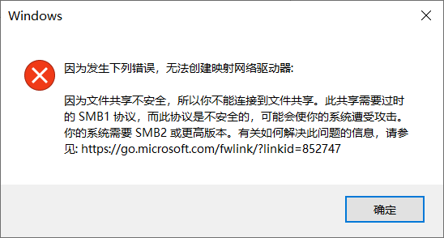
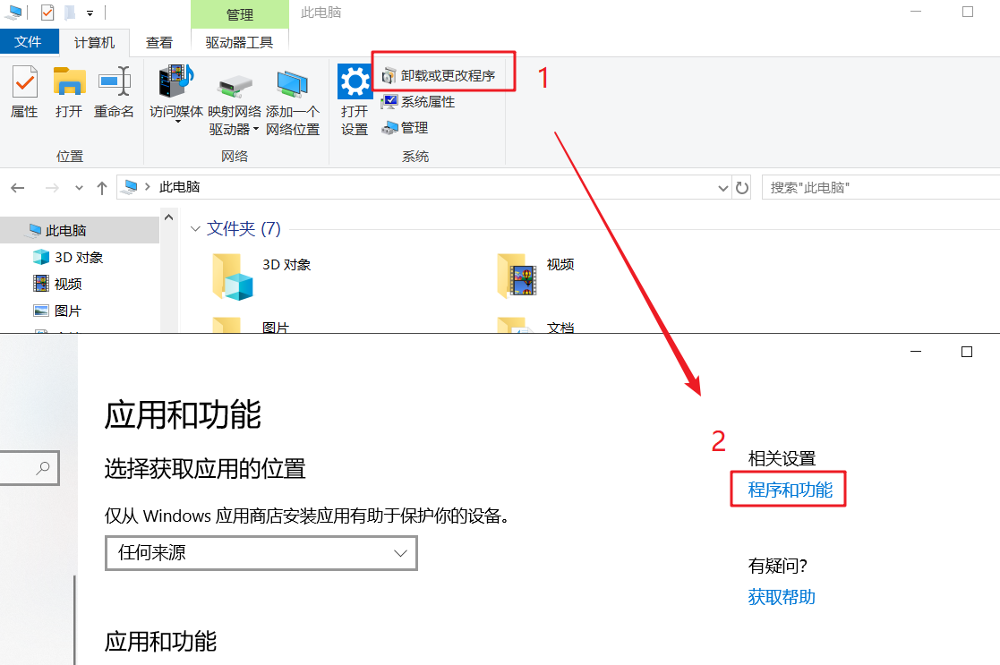
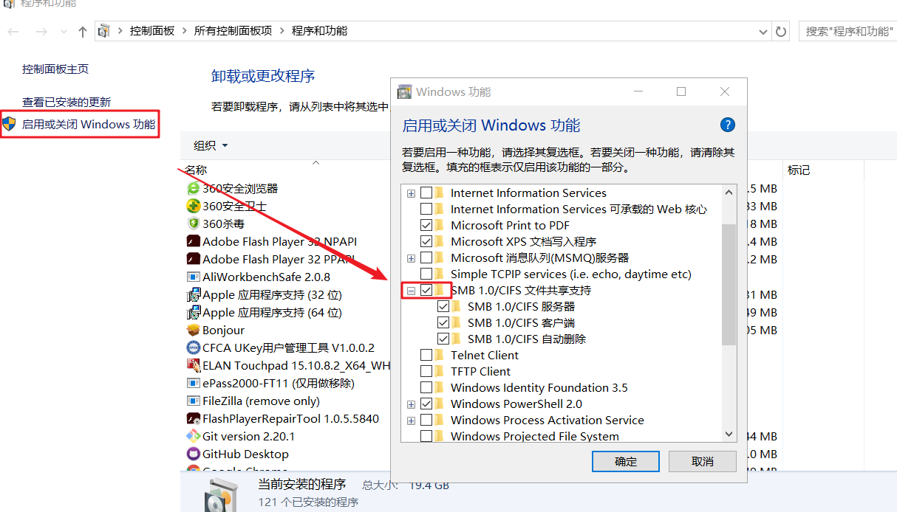

#“此共享需要过时的SMB1协议，而此协议是不安全的”解决方法

因为新型冠状病毒感染肺炎的事情，根据公司安排，选择在家远程办公。
在使用Win10连接虚拟机的共享目录时出了下列错误，无法连接。查找相关的材料，总之是现在高版本的系统，默认不开启这个开关了，但是也是给留下了入口，大家可以自行开启。下面介绍一下方法：

1. 从计算机中进入卸载和更改程序界面, 找到程序和功能按钮链接

1. 进入熟悉的界面，选择左边【启用或关闭Windows功能】，再弹出窗口中勾选【SMB1.0/CIFS文件共享支持】

3. 按照要求重启电脑生效

